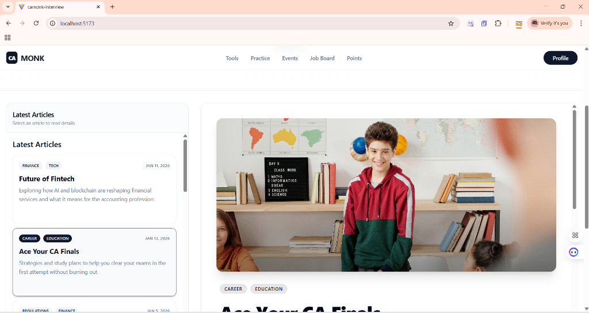
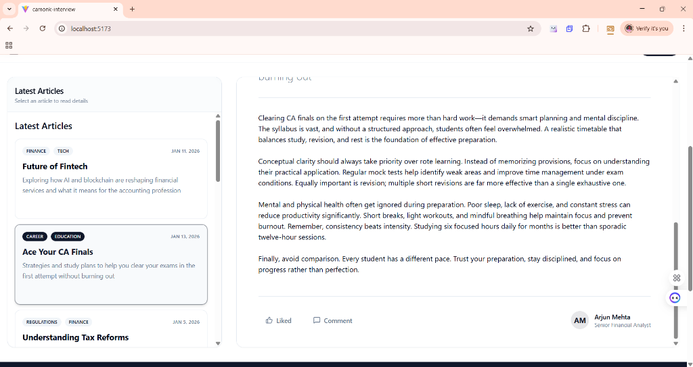
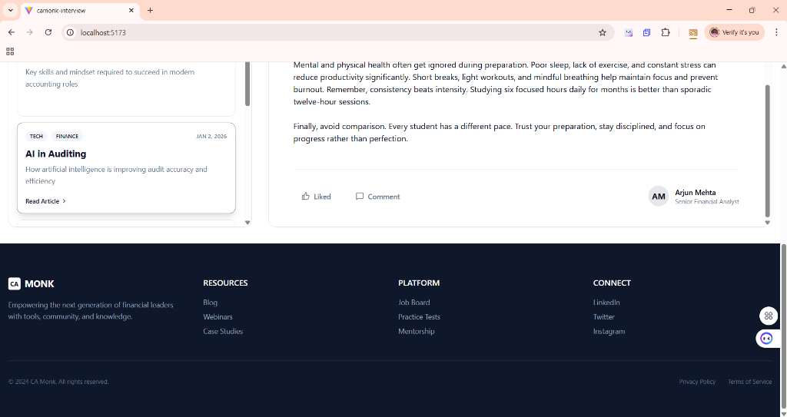

# CA Monk Blog Application

A modern, responsive blog application built with React, TanStack Query, Tailwind CSS, and shadcn/ui components.

## � Screenshots

### Home Page - Split Panel Layout


### Blog Detail View


### Reading Blog Content


### Blog Selection


### Footer Design


---

## �🚀 Project Solution & Implementation Details

I have completed the assignment with the following features and architectural decisions:

### ✅ Implemented Features

| Feature | Description |
|---------|-------------|
| **Split-Panel Layout** | Master-detail architecture with scrollable blog list (left) and dynamic detail view (right) |
| **View All Blogs** | Fetches blogs using `useQuery` with loading skeletons |
| **View Blog Detail** | Instant view switching with `useQuery` caching |
| **Create New Blog** | Full form with validation using `useMutation` and auto-invalidation |
| **Responsive Design** | Adapts from split-panel (desktop) to stacked layout (mobile) |
| **Loading States** | Skeleton components during data fetch |
| **Error Handling** | Error messages displayed if API calls fail |

### 🎨 UI Polish
- Custom `Header` and `Footer` components matching the brand design
- Animated interactions (hover effects, smooth transitions)
- Dynamic "Read Time" calculation
- Category badges with color coding
- Like and Comment UI elements

---

## 🛠 Tech Stack

| Technology | Version | Purpose |
|------------|---------|---------|
| React | 19 | UI Framework |
| TypeScript | 5.9 | Type Safety |
| TanStack Query | v5 | Server State Management |
| Tailwind CSS | v3.4 | Styling |
| shadcn/ui | Latest | UI Components |
| Vite | 7.x | Build Tool |
| JSON Server | 1.0 | Mock Backend API |

---

## 📂 Project Structure

```
src/
├── components/
│   ├── ui/              # shadcn/ui components (Button, Card, Badge, etc.)
│   ├── BlogCard.tsx     # Individual blog card component
│   ├── BlogDetailPanel.tsx  # Right panel showing full blog
│   ├── BlogListPanel.tsx    # Left panel with blog list
│   ├── Header.tsx       # Navigation header
│   ├── Footer.tsx       # Site footer
│   └── CreateBlog.tsx   # Blog creation form
├── pages/
│   └── Home.tsx         # Main layout controller
├── lib/
│   ├── api.ts           # API service layer
│   └── utils.ts         # Utility functions
├── App.tsx              # Route configuration
└── main.tsx             # App entry point
```

---

## 🔧 Getting Started

### Prerequisites
- Node.js (v18 or higher)
- npm or yarn
- Git

### Clone the Repository

```bash
# Clone the repo
git clone https://github.com/YOUR_USERNAME/camonk-interview.git

# Navigate to project directory
cd camonk-interview

# Install dependencies
npm install
```

### Run the Application

You need to run **two terminals** - one for the backend API and one for the frontend:

**Terminal 1 - Start JSON Server (Backend API):**
```bash
npm run server
```
This starts the API on `http://localhost:3001`

**Terminal 2 - Start Development Server (Frontend):**
```bash
npm run dev
```
This starts the app on `http://localhost:5173`

### Available Scripts

| Command | Description |
|---------|-------------|
| `npm run dev` | Start Vite development server |
| `npm run server` | Start JSON Server on port 3001 |
| `npm run build` | Build for production |
| `npm run preview` | Preview production build |
| `npm run lint` | Run ESLint |

---

## 🌐 API Endpoints

| Method | Endpoint | Description |
|--------|----------|-------------|
| GET | `/blogs` | Fetch all blogs |
| GET | `/blogs/:id` | Fetch single blog by ID |
| POST | `/blogs` | Create a new blog |

---

## 📝 Key Implementation Details

### TanStack Query Usage

```typescript
// Fetching all blogs with caching
const { data: blogs, isLoading } = useQuery({
  queryKey: ['blogs'],
  queryFn: fetchBlogs,
});

// Creating blog with cache invalidation
const mutation = useMutation({
  mutationFn: createBlog,
  onSuccess: () => {
    queryClient.invalidateQueries({ queryKey: ['blogs'] });
    navigate('/');
  },
});
```

### Responsive Design
- Desktop: Split-panel layout (blog list + detail view)
- Mobile: Stacked layout with navigation

---

## 👤 Author

Built as part of the CA Monk Frontend Interview Assignment.

---

## 📄 License

This project is for assessment purposes only.
